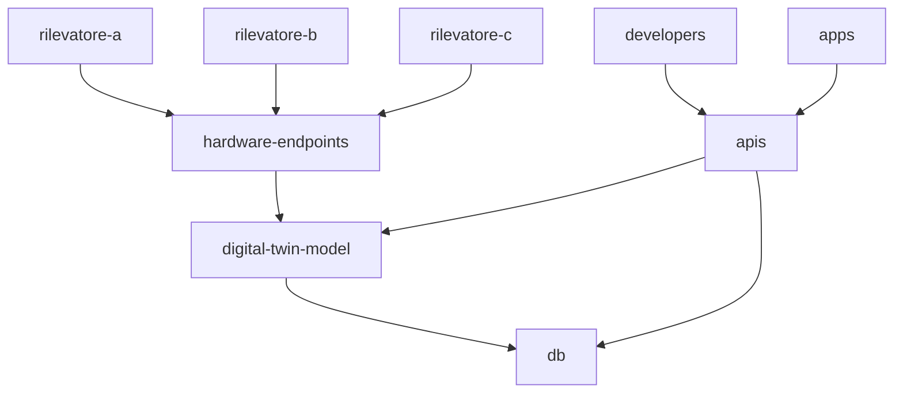

# OUR WATER

Un progetto che prova ad offrire uno strumento per aiutarci a rispettare uno dei beni più preziosi che abbiamo, l'acqua.

Sempre più di questi tempi, assistiamo a un estremizzazione di uno degli elementi cardini della vita.
Sentiamo notizie che descrivono scenari dove l'acqua non c'è a sufficienza, c'è in eccessiva abbondanza oppure c'è ma con un tasso di inquinamento eccessivamente alto.

Per poter invertire questa tendenza estrema, Our Water, si propone come un progetto di tutti, open source, per poter sfruttare l'ingegno al fine di ritrovare un equilibrio anche attraverso strumenti moderni.

### Obiettivi:
Gli obiettivi di questo progetto sono:
- Creare degli strumenti per monitorare:
  - la quantità di acqua nel territorio e il suo cambiamento nel tempo
  - la qualità dell'acqua e il suo cambiamento nel tempo
  - la portata dei corsi d'acqua in tempo reale
  - la mal gestione dell'uso di acqua
- Creare degli strumenti per permettere di avere una piattaforma digitale dell'acqua che aiuti a scegliere decisioni più consapevoli
- Creare degli strumenti per poter aver una base dati nazionale condivisa, libera a participazione volontaria e libera:
  - sarebbe bello dare la possibilità di segnalare situazioni pericolose (es alluvioni o esondazioni)
- Dare la possibilità di far interagire vari dati e strumenti:
  - poter mandare notifiche alle persone con bollettini di emergenze
- Altre idee sono le benvenute

### Possibile prototipo di infrastruttura digitale:
- Endpoint dove gli apparati possono mandare i loro dati
- Elaboratori di dati che possono trasformare i vari protocolli degli strumenti, in un modello dati condiviso e comune
- Rappresentazione in Digital Twin della struttura di monitoraggio
- Endpoint dove enti, sviluppatori e applicazioni, possano richiedere i dati, attuali e storici

### Possibili endpoint per gli hardware:
- Broker Mqtt (emqx)
  - Endpoint CoAP/LWM2M
  - Mqtt over WebSocket
- Endpoint API Rest
- Endpoint SMS (twilio)
- Endpoint LoRa (The Things Network)

##### NB
- Ogni contenuto di questa repository è libera e accessibile ai fini di poter aiutare nel costruire qualcosa di utile per tutti.
- Il presuppposto quindi è che nulla qui dentro è a fine di lucro se non al fine del mantenimento di essa stessa.
- Ogni idea qui dentro ha pari valore con le altre ed esse sono prive di un rendiconto economico ma con un alto valore sociale
